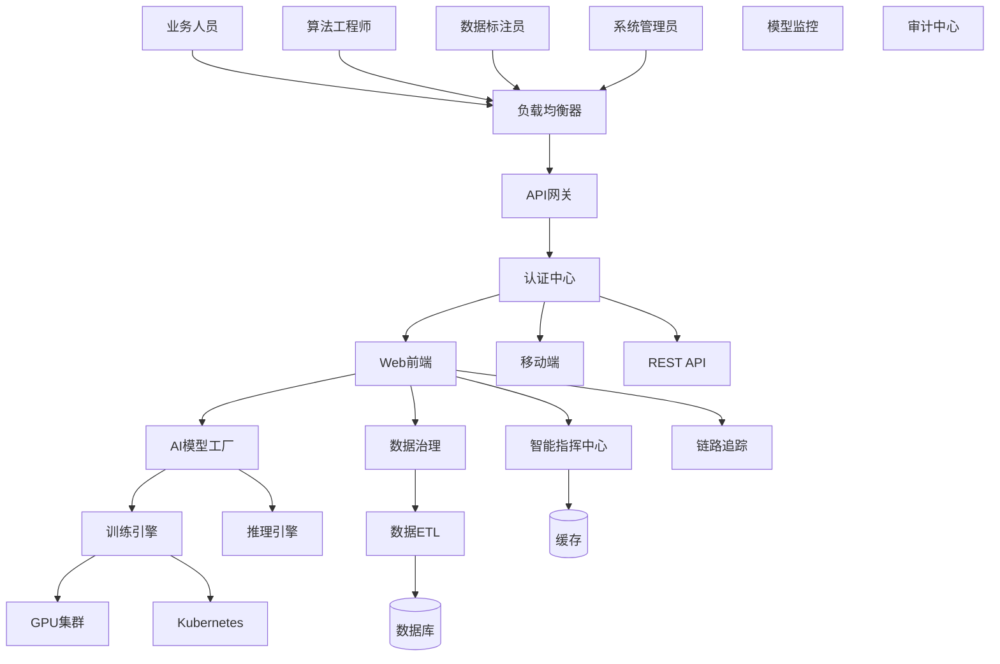
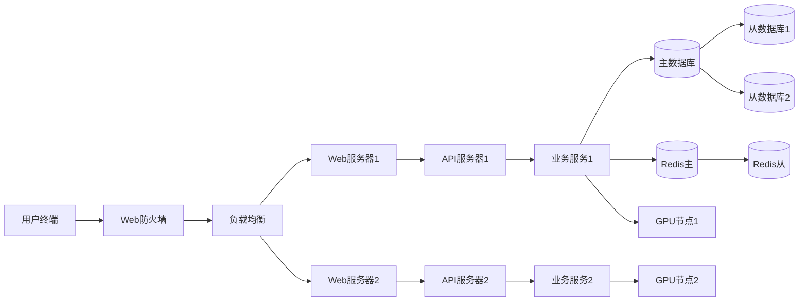
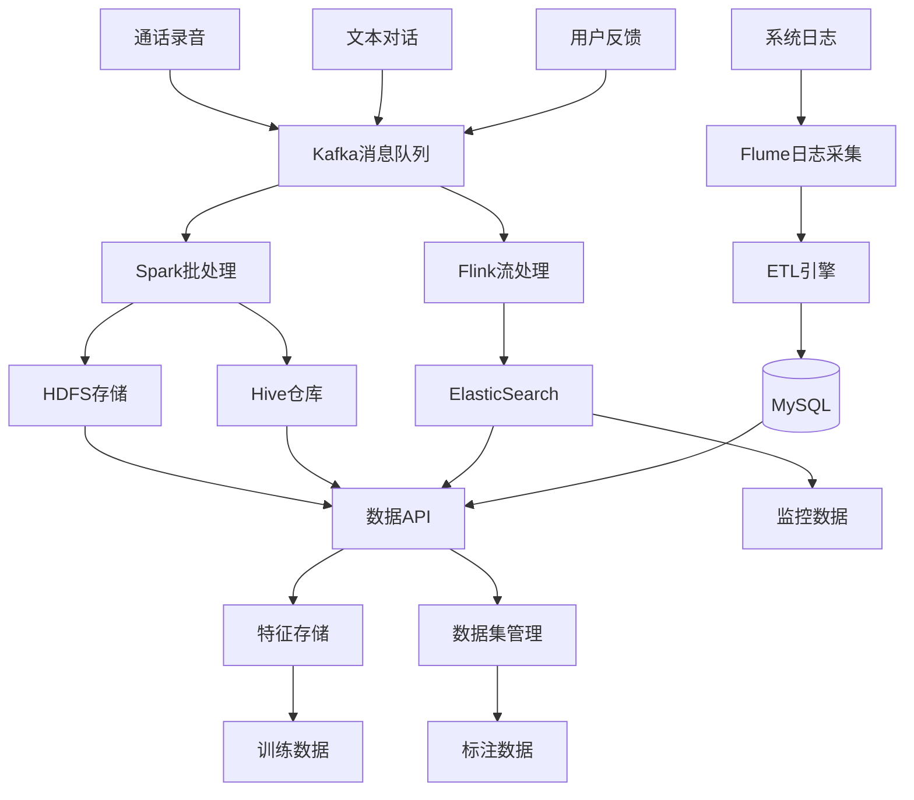
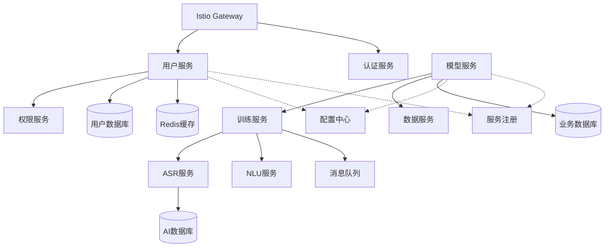
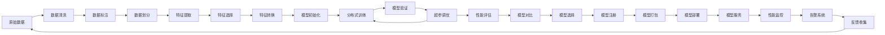
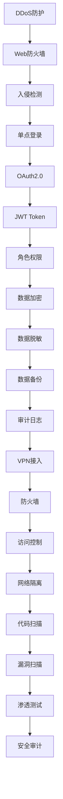
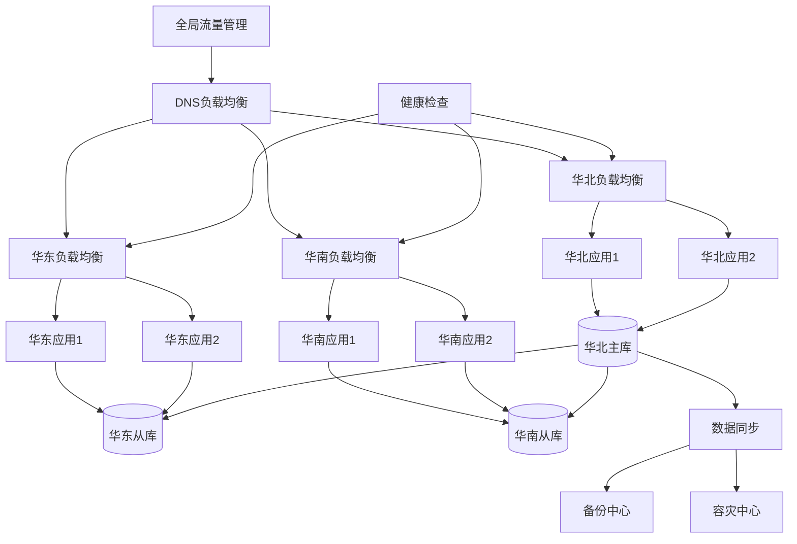

# 移动智能语音AI训练中台 - 系统组网架构图（亿图图示版）

## 使用说明
1. 复制下面的Mermaid代码到亿图图示
2. 或者参考"手动绘制指南"部分手动创建图表

---

## 1. 总体架构图

### Mermaid代码

### 手动绘制指南
**层次结构（从上到下）：**

1. **用户层**
   - 业务人员、算法工程师、数据标注员、系统管理员

2. **接入层**
   - 负载均衡器 → API网关 → 认证中心

3. **应用层**
   - Web前端、移动端、REST API

4. **业务服务层**
   - 智能指挥中心、AI模型工厂、数据治理、链路追踪、模型监控、审计中心

5. **平台层**
   - 训练引擎、推理引擎、数据ETL

6. **基础设施层**
   - GPU集群、Kubernetes、数据库、缓存

**连接关系：**
- 用户层 → 负载均衡器
- 负载均衡器 → API网关 → 认证中心
- 认证中心 → 应用层（Web/移动端/API）
- 应用层 → 业务服务层
- 业务服务层 → 平台层
- 平台层 → 基础设施层

---

## 2. 网络拓扑架构

### Mermaid代码

### 手动绘制指南
**网络分区（从左到右）：**

1. **公网区域**
   - 用户终端

2. **DMZ区域**
   - Web防火墙 → 负载均衡器

3. **应用区域**
   - Web服务器1、Web服务器2
   - API服务器1、API服务器2

4. **业务区域**
   - 业务服务1、业务服务2

5. **数据区域**
   - 主数据库 → 从数据库1、从数据库2
   - Redis主 → Redis从

6. **计算区域**
   - GPU节点1、GPU节点2

---

## 3. 数据流架构

### Mermaid代码

### 手动绘制指南
**数据流向（从上到下）：**

1. **数据采集层**
   - 通话录音、文本对话、用户反馈 → Kafka
   - 系统日志 → Flume

2. **数据接入层**
   - Kafka、Flume

3. **数据处理层**
   - Spark批处理、Flink流处理、ETL引擎

4. **数据存储层**
   - HDFS、Hive、ElasticSearch、MySQL

5. **数据服务层**
   - 数据API、特征存储、数据集管理

6. **数据应用层**
   - 训练数据、标注数据、监控数据

---

## 4. 微服务架构

### Mermaid代码

### 手动绘制指南
**服务分组：**

1. **服务网关**
   - Istio Gateway

2. **核心服务**
   - 用户服务、认证服务、权限服务

3. **业务服务**
   - 模型服务、训练服务、数据服务

4. **AI服务**
   - ASR服务、NLU服务

5. **支撑服务**
   - 配置中心、服务注册

6. **数据层**
   - 用户数据库、业务数据库、AI数据库、Redis缓存、消息队列

**连接类型：**
- 实线：直接调用
- 虚线：配置/注册关系

---

## 5. AI训练流程架构

### Mermaid代码

### 手动绘制指南
**流程阶段（从左到右）：**

1. **数据准备**
   - 原始数据 → 数据清洗 → 数据标注 → 数据划分

2. **特征工程**
   - 特征提取 → 特征选择 → 特征转换

3. **模型训练**
   - 模型初始化 → 分布式训练 → 模型验证 → 超参调优
   - （超参调优可循环回分布式训练）

4. **模型评估**
   - 性能评估 → 模型对比 → 模型选择

5. **模型部署**
   - 模型注册 → 模型打包 → 模型部署 → 模型服务

6. **监控反馈**
   - 性能监控 → 告警系统 → 反馈收集
   - （反馈收集循环回原始数据）

---

## 6. 安全架构

### Mermaid代码

### 手动绘制指南
**安全层次（从上到下）：**

1. **安全防护层**
   - DDoS防护 → Web防火墙 → 入侵检测

2. **认证授权层**
   - 单点登录 → OAuth2.0 → JWT Token → 角色权限

3. **数据安全层**
   - 数据加密 → 数据脱敏 → 数据备份 → 审计日志

4. **网络安全层**
   - VPN接入 → 防火墙 → 访问控制 → 网络隔离

5. **应用安全层**
   - 代码扫描 → 漏洞扫描 → 渗透测试 → 安全审计

---

## 7. 高可用架构

### Mermaid代码

### 手动绘制指南
**多地域部署：**

1. **全局层**
   - 全局流量管理 → DNS负载均衡 → 健康检查

2. **华北区域**
   - 负载均衡 → 应用1、应用2 → 主数据库

3. **华东区域**
   - 负载均衡 → 应用1、应用2 → 从数据库

4. **华南区域**
   - 负载均衡 → 应用1、应用2 → 从数据库

5. **数据同步**
   - 华北主库 → 华东从库、华南从库
   - 数据同步 → 备份中心、容灾中心

---

## 亿图图示绘制技巧

### 1. 图形选择
- **矩形框**: 用于服务、组件
- **圆柱体**: 用于数据库、存储
- **云形**: 用于云服务
- **六边形**: 用于网关、代理
- **菱形**: 用于决策点

### 2. 颜色方案
- **蓝色系**: 用户层、应用层
- **绿色系**: 业务服务层
- **橙色系**: 平台层、计算资源
- **紫色系**: 数据层、存储
- **红色系**: 安全组件

### 3. 连接线
- **实线箭头**: 数据流、调用关系
- **虚线箭头**: 配置、监控关系
- **双向箭头**: 双向通信
- **粗线**: 主要数据流
- **细线**: 辅助关系

### 4. 分组建议
- 使用**容器/泳道**对相同层次的组件分组
- 使用**背景色块**区分不同的功能域
- 添加**标题文本框**标注每个分组

### 5. 布局建议
- **总体架构**: 采用分层布局（从上到下）
- **网络拓扑**: 采用从左到右的流程布局
- **数据流**: 采用从上到下或从左到右的流程布局
- **微服务**: 采用中心辐射布局
- **训练流程**: 采用从左到右的流程布局

---

## 图表尺寸建议

- **A3横向**: 适合总体架构图、网络拓扑图
- **A4横向**: 适合微服务架构、数据流架构
- **A4竖向**: 适合训练流程、安全架构

---

## 导出建议

1. **PNG格式**: 用于文档插入，建议300 DPI
2. **PDF格式**: 用于打印和分享
3. **SVG格式**: 用于网页展示，可无损缩放

---

*文档版本: V1.0*  
*适用工具: 亿图图示 (EdrawMax)*  
*最后更新: 2024年*
