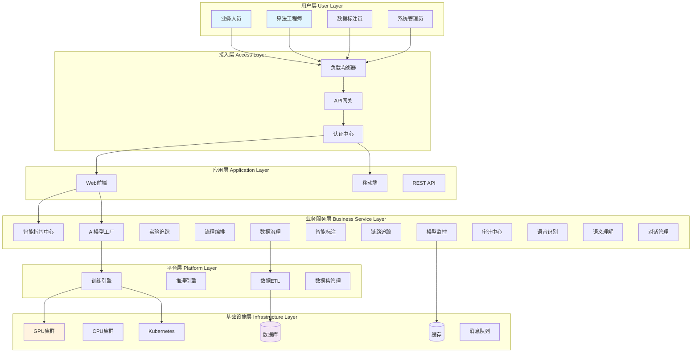
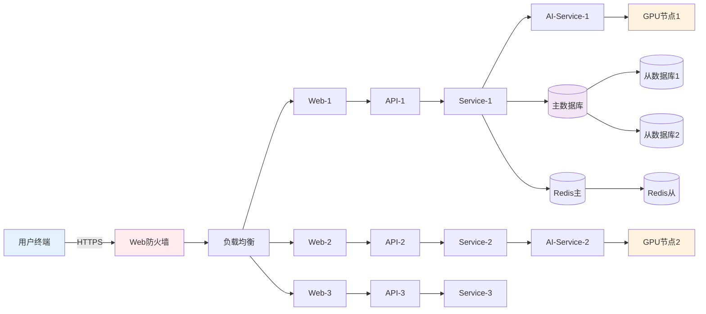
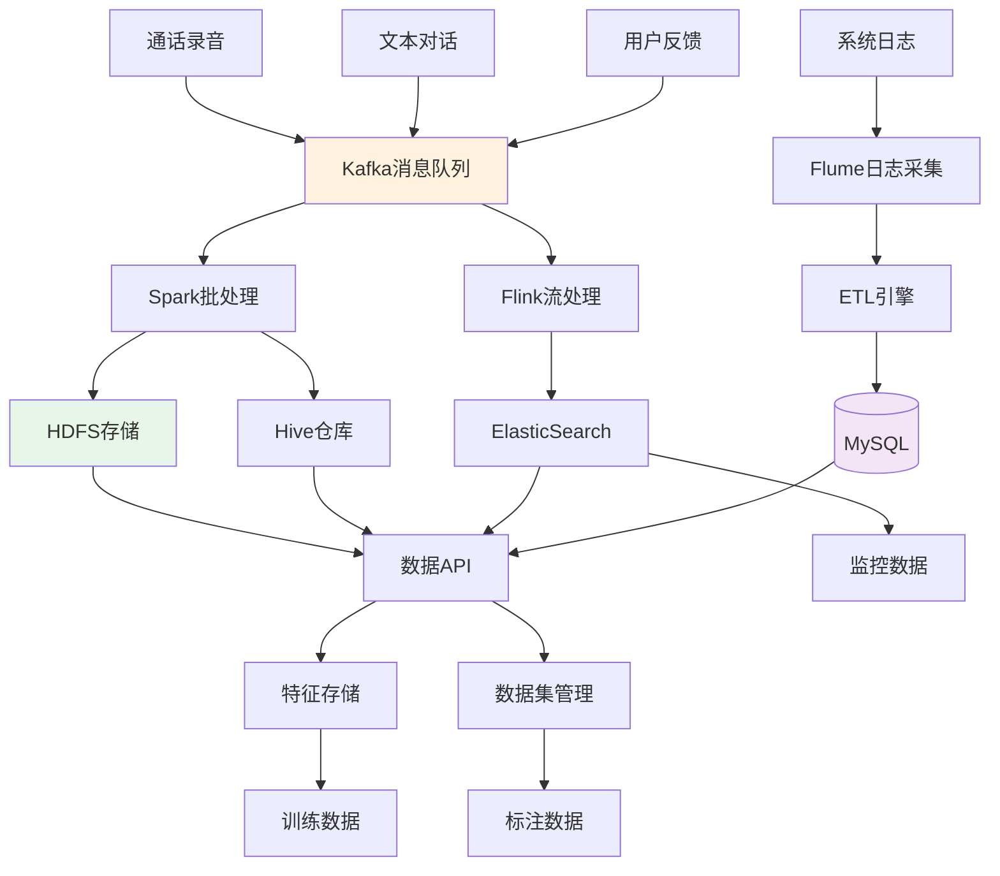
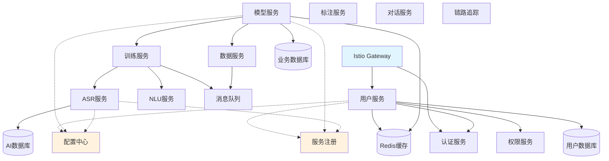
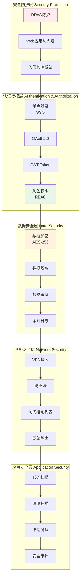
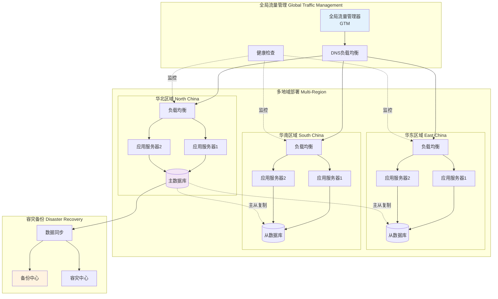

# 移动智能语音AI训练中台 - 系统组网架构图

## 文档信息
- **系统名称**: 移动智能语音AI训练中台
- **版本**: V1.0
- **创建日期**: 2024年
- **架构类型**: 云原生微服务架构

---

## 1. 总体架构图



---

## 2. 网络拓扑架构



---

## 3. 数据流架构



---

## 4. 微服务架构



---

## 5. 训练流程架构

```mermaid
graph LR
    RAW[原始数据]
    CLEAN[数据清洗]
    LABEL[数据标注]
    SPLIT[数据划分]
    
    EXTRACT[特征提取]
    SELECT[特征选择]
    TRANSFORM[特征转换]
    
    INIT[模型初始化]
    TRAIN[分布式训练]
    VALID[模型验证]
    TUNE[超参调优]
    
    EVAL[性能评估]
    COMPARE[模型对比]
    SELECT_MODEL[模型选择]
    
    REGISTER[模型注册]
    PACKAGE[模型打包]
    DEPLOY[模型部署]
    SERVE[模型服务]
    
    MONITOR[性能监控]
    ALERT_SYS[告警系统]
    FEEDBACK[反馈收集]
    RETRAIN[模型重训]

    RAW --> CLEAN
    CLEAN --> LABEL
    LABEL --> SPLIT

    SPLIT --> EXTRACT
    EXTRACT --> SELECT
    SELECT --> TRANSFORM

    TRANSFORM --> INIT
    INIT --> TRAIN
    TRAIN --> VALID
    VALID --> TUNE
    TUNE -.-> TRAIN

    TUNE --> EVAL
    EVAL --> COMPARE
    COMPARE --> SELECT_MODEL

    SELECT_MODEL --> REGISTER
    REGISTER --> PACKAGE
    PACKAGE --> DEPLOY
    DEPLOY --> SERVE

    SERVE --> MONITOR
    MONITOR --> ALERT_SYS
    ALERT_SYS --> FEEDBACK
    FEEDBACK --> RETRAIN
    RETRAIN -.-> RAW

    style TRAIN fill:#fff3e0
    style DEPLOY fill:#e8f5e9
    style MONITOR fill:#e3f2fd
```



---

## 6. 安全架构



---

## 7. 高可用架构



---

## 8. 技术栈说明

### 前端技术栈
- **框架**: React 18 / Vue 3
- **UI组件**: Ant Design / Element Plus
- **状态管理**: Redux / Vuex
- **图表**: ECharts / D3.js
- **构建工具**: Webpack / Vite

### 后端技术栈
- **开发语言**: Python 3.9+, Java 11+, Go 1.18+
- **Web框架**: FastAPI, Spring Boot, Gin
- **RPC框架**: gRPC, Dubbo
- **API网关**: Kong, Nginx

### AI/ML技术栈
- **深度学习**: PyTorch 1.12+, TensorFlow 2.9+
- **训练框架**: Horovod, DeepSpeed
- **模型服务**: TorchServe, TensorFlow Serving
- **实验管理**: MLflow, Weights & Biases

### 数据技术栈
- **数据库**: MySQL 8.0, PostgreSQL 14
- **缓存**: Redis 7.0, Memcached
- **消息队列**: Kafka 3.0, RabbitMQ
- **搜索引擎**: Elasticsearch 8.0

### 基础设施
- **容器**: Docker 20.10+
- **编排**: Kubernetes 1.24+
- **服务网格**: Istio 1.14+
- **CI/CD**: GitLab CI, Jenkins, ArgoCD

### 监控运维
- **指标监控**: Prometheus, Grafana
- **日志分析**: ELK Stack (Elasticsearch, Logstash, Kibana)
- **链路追踪**: Jaeger, Zipkin
- **告警**: AlertManager, PagerDuty

---

## 9. 网络规划

### IP地址规划
```
生产环境 VPC: 10.0.0.0/16
├── DMZ区: 10.0.1.0/24
├── 应用区: 10.0.10.0/23
├── 业务区: 10.0.20.0/22
├── 数据区: 10.0.30.0/24
└── 计算区: 10.0.40.0/22

测试环境 VPC: 10.1.0.0/16
开发环境 VPC: 10.2.0.0/16
```

### 端口规划
```
HTTP: 80
HTTPS: 443
API Gateway: 8080
服务端口: 8000-8999
数据库: 3306 (MySQL), 5432 (PostgreSQL)
缓存: 6379 (Redis)
消息队列: 9092 (Kafka)
监控: 9090 (Prometheus), 3000 (Grafana)
```

---

## 10. 部署规模

### 服务器配置
| 类型 | 数量 | 配置 | 用途 |
|------|------|------|------|
| 负载均衡器 | 2 | 8C16G | 流量分发 |
| Web服务器 | 6 | 16C32G | 前端服务 |
| API服务器 | 10 | 32C64G | 后端API |
| AI服务器 | 8 | 64C256G + 8×A100 | AI训练推理 |
| 数据库服务器 | 3 | 32C128G + 2TB SSD | 数据存储 |
| 缓存服务器 | 4 | 16C64G | 缓存服务 |
| 存储服务器 | 6 | 16C32G + 20TB HDD | 对象存储 |

### 存储规模
- **数据库存储**: 10TB (3副本)
- **对象存储**: 100TB (2副本)
- **日志存储**: 20TB (保留90天)
- **备份存储**: 50TB (异地备份)

### 网络带宽
- **公网带宽**: 10Gbps
- **内网带宽**: 100Gbps
- **存储网络**: 40Gbps

---

## 总结

本系统采用云原生微服务架构，具备以下特点：

1. **高可用**: 多地域部署，主从热备，故障自动切换
2. **高性能**: GPU加速，分布式训练，负载均衡
3. **高安全**: 多层防护，数据加密，权限控制
4. **可扩展**: 容器化部署，弹性伸缩，服务解耦
5. **易运维**: 自动化部署，全链路监控，智能告警

系统设计遵循业界最佳实践，满足千万级用户并发访问需求。

---

*文档版本: V1.0*  
*最后更新: 2024年*
